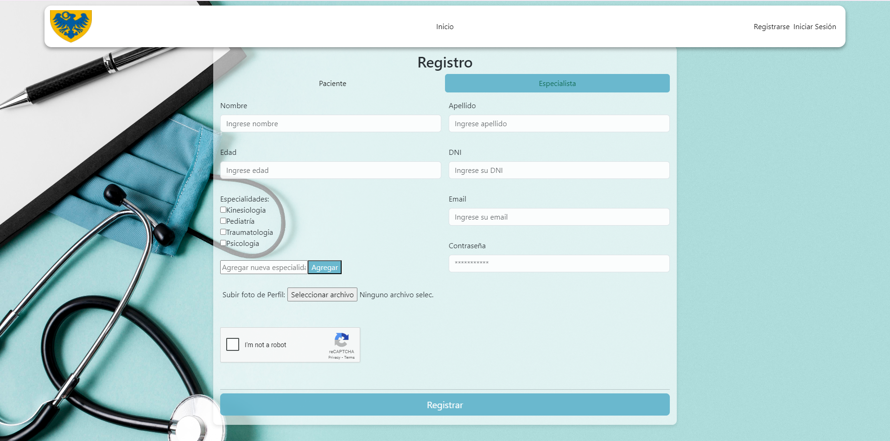
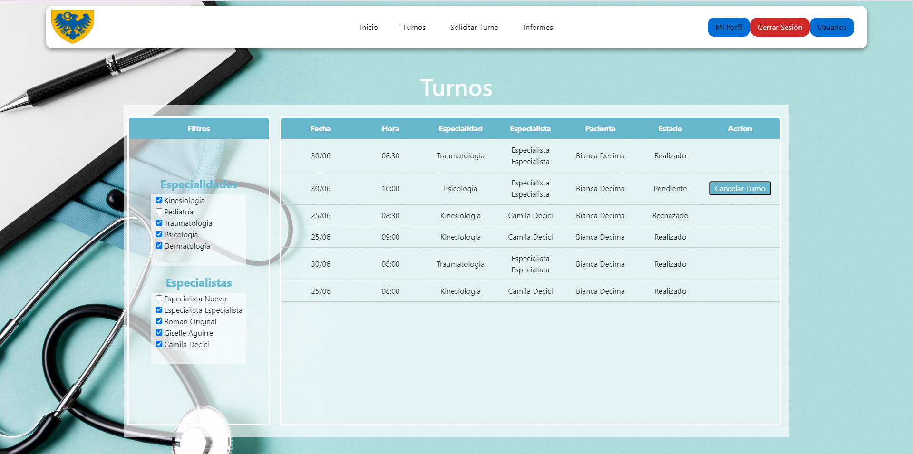

# Abril Clínica Online

Abril Clínica Online es un proyecto de desarrollo web que se encarga de la gestión de turnos medicos. Permite el ingreso de usuarios de 3 perfiles (pacientes, especialistas y administradores), quienes tendrán acceso a diferentes secciones para llevar a cabo la organización y administración de la clínica. A continuación, se presenta un detalle de las diferentes funcionalidades de la página.

## Inicio

Página de inicio que permite acceder al inicio de sesión y al registro de usuarios. 

## Inicio de Sesión

Sección que permite iniciar sesión a usuarios registrados. Contiene accesos rápidos. 

## Registro

Permite registrar usuarios de perfil paciente o especialista, solicitando diferentes datos personales.

## Usuarios

Sección disponible solo para usuarios con perfil de administrador. Se puede ver el listado de todos los usuarios de la clínica, los datos de los mismos y permite registar un usuario nuevo, ya sea paciente, especialista o administrador.

## Perfil

Muestra el perfil del paciente o especialista con los datos del usuario. En el caso del especialista, permite seleccionar la disponibilidad horaria para cada una de sus especialidades.

## Mis turnos

Como paciente, permite ver los turnos solicitados y el estado en el que se encuentran, con la posibilidad de cancelarlos, ver su reseña, completar una encuesta o calificar la atención del especialista. Para el perfil especialista, podrá ver sus turnos con posiblidad de cancelarlos,  rechazarlos, aceptarlos y finalizarlos. 

## Turnos

Acceso permitido solo para usuarios con perfil administrador.  Podrá ver los turnos de la clínica y cancelarlos.

## Solicitar turnos

En esta sección tanto el paciente como el administrador podrán solicitar turnos.

